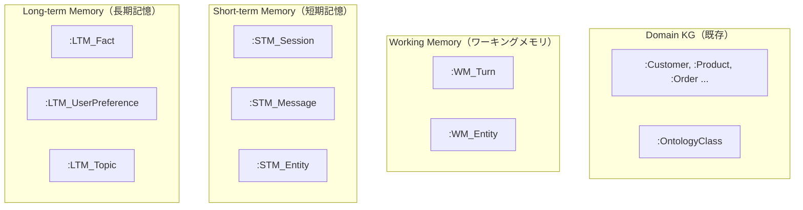

# FastAPI Webサービス化 + メモリ階層型ナレッジグラフの実装計画

## 概要

CLIアプリケーションはそのまま残しつつ、FastAPIによるWeb APIサーバーを追加します。
さらに、RAG用のドメインナレッジグラフとは独立した **3階層のメモリ用ナレッジグラフ** をNeo4j上に構築し、セッション管理と文脈を踏まえた対話を実現します。

## メモリアーキテクチャ

Neo4j上に以下の4種類のグラフ空間を共存させます。ラベルのプレフィックスで分離します。



### 1. Domain KG（既存・変更なし）
- `extract` / `populate` で構築されるナレッジグラフ。
- ラベル: `:OntologyClass`, `:Customer`, `:Product` 等（既存のまま）。
- `ask` の際にCypherで検索される対象。

### 2. Working Memory（ワーキングメモリ）
- **寿命**: 1ターン（1回のリクエスト〜レスポンスの間のみ）。レスポンス返却後に破棄。
- **目的**: 現在のターンで扱っている情報を一時的に保持する。
  - 例: 「現在の質問」「生成されたCypher」「取得した検索結果」「回答中に参照したエンティティ」
- **ラベル**: `:WM_Turn`, `:WM_Entity`
- **挙動**: リクエスト処理開始時に作成、レスポンス返却後にNeo4jから削除。

### 3. Short-term Memory（短期記憶）
- **寿命**: セッション単位。セッションが終了（タイムアウトまたは明示的終了）するまで保持。
- **目的**: 同一セッション内の過去のやり取り（Q&A履歴）と、そこで登場したエンティティを記憶する。
  - 例: 「山田太郎について聞いた」→ 次の質問で「その人の」と言われたら「山田太郎」を解決できる。
- **ラベル**: `:STM_Session`, `:STM_Message`, `:STM_Entity`
- **構造**:
  ```
  (:STM_Session {id, created_at, last_active_at})
    -[:HAS_MESSAGE]-> (:STM_Message {role, content, timestamp, turn_number})
    -[:MENTIONS]-> (:STM_Entity {name, label, resolved_from})
  ```

### 4. Long-term Memory（長期記憶）
- **寿命**: 永続。セッションを跨いで保持される。
- **目的**: 複数セッションにわたって蓄積される知識・傾向を保持する。
  - 例: 「このユーザーは配送関連の質問が多い」「『マットレス』は頻出トピック」
- **ラベル**: `:LTM_Fact`, `:LTM_UserPreference`, `:LTM_Topic`
- **構造**:
  ```
  (:LTM_Fact {content, source_session, created_at, access_count})
  (:LTM_Topic {name, frequency, last_accessed})
  (:LTM_UserPreference {key, value})
  ```
- **更新タイミング**: セッション終了時に、短期記憶から重要な情報を要約・昇格させる。

## Proposed Changes / 提案する変更内容

---

### 1. 依存ライブラリの追加

#### [MODIFY] [pyproject.toml](file:///Users/kakusuke/python/ontology_extractor/pyproject.toml)
- `fastapi`, `uvicorn[standard]` を `dependencies` に追加。
- `ontology-api` スクリプトエントリーポイントを追加。

---

### 2. メモリ管理モジュール（新規）

#### [NEW] `src/ontology_extractor/memory.py`
3階層のメモリを管理するクラスを実装します。

- `MemoryManager` クラス:
  - `create_working_memory(session_id, question, cypher, results)`: ワーキングメモリの作成
  - `clear_working_memory(session_id)`: ワーキングメモリの破棄
  - `add_to_short_term(session_id, role, content, entities)`: 短期記憶へのメッセージ追加
  - `get_short_term_history(session_id, limit)`: 短期記憶の取得（直近N件）
  - `get_session_entities(session_id)`: セッション中に言及されたエンティティ一覧の取得
  - `promote_to_long_term(session_id)`: セッション終了時に短期記憶から長期記憶へ昇格
  - `get_long_term_context()`: 長期記憶からの関連コンテキスト取得
  - `cleanup_expired_sessions(ttl_minutes)`: 期限切れセッションの掃除

---

### 3. `neo4j_client.py` の拡張

#### [MODIFY] [neo4j_client.py](file:///Users/kakusuke/python/ontology_extractor/src/ontology_extractor/neo4j_client.py)
- `query_kg` メソッドを拡張し、`session_id` と `MemoryManager` を受け取れるようにする。
- Cypher生成時のプロンプトに、短期記憶（直近の会話履歴）と長期記憶（頻出トピック等）のコンテキストを注入する。

---

### 4. FastAPI アプリケーション（新規）

#### [NEW] `src/ontology_extractor/api.py`
以下のエンドポイントを持つFastAPIアプリケーション。

| Method | Path | 説明 |
|--------|------|------|
| `POST` | `/extract` | テキストからオントロジーを抽出・保存 |
| `POST` | `/populate` | テキストからナレッジグラフを構築 |
| `POST` | `/ask` | 質問を受け取り回答を返す（`session_id` 対応） |
| `POST` | `/sessions` | 新しいセッションを作成 |
| `GET` | `/sessions/{session_id}` | セッション情報・履歴を取得 |
| `DELETE` | `/sessions/{session_id}` | セッションを終了（短期→長期への昇格を実行） |
| `GET` | `/health` | ヘルスチェック |

---

## リクエスト/レスポンス例

### `POST /ask`

```json
// Request
{
  "session_id": "abc-123",
  "question": "山田太郎が注文した商品は？"
}

// Response
{
  "session_id": "abc-123",
  "answer": "山田太郎さんが注文した商品は「快眠プレミアムマットレス」です。",
  "cypher": "MATCH (c:Customer {name: '山田太郎'})-[:HAS_ORDERED]->(p:Product) RETURN p.name",
  "data": [{"p.name": "快眠プレミアムマットレス"}]
}
```

### 連続会話（セッション活用例）
```json
// 1回目: POST /ask
{"session_id": "abc-123", "question": "山田太郎が注文した商品は？"}
// → 「快眠プレミアムマットレスです。」

// 2回目: POST /ask（短期記憶により「その人」= 山田太郎 と解決される）
{"session_id": "abc-123", "question": "その人の届け先は？"}
// → 「北海道札幌市中央区北一条西2-3-4です。」
```

---

> [!IMPORTANT]
> **User Review Required / ユーザー確認事項**
>
> 1. **長期記憶への昇格ロジック** について。セッション終了時にLLMを使って「このセッションで重要だった事実を要約して長期記憶に保存する」というアプローチで進めてよいでしょうか？（LLMを使わず、単純に「言及頻度が高いエンティティを保存する」だけでも可能です）
>
> 2. **セッションの有効期限** はデフォルトで30分（最後のアクセスから）で設定する想定です。変更したい場合はご指示ください。
>
> 3. **ワーキングメモリ** は厳密には1ターンで破棄するため「Neo4jに書き込むオーバーヘッドが無駄では？」とも言えます。パフォーマンス優先でワーキングメモリだけはインメモリ（Python辞書）にする選択肢もありますが、3層すべてをNeo4jグラフで統一する方が方針として一貫性があるかと思います。どちらが望ましいでしょうか？

## Verification Plan / 検証計画

### 手動テスト
1. `uv run uvicorn ontology_extractor.api:app --reload` でサーバー起動。
2. `POST /sessions` で新しいセッションを作成。
3. 同じ `session_id` で `POST /ask` を複数回実行し、文脈が維持されていることを確認。
4. `DELETE /sessions/{session_id}` でセッション終了後、長期記憶にデータが昇格していることをNeo4j Browserで確認。
5. 新しいセッションで質問し、長期記憶の情報が回答に反映されるか確認。
